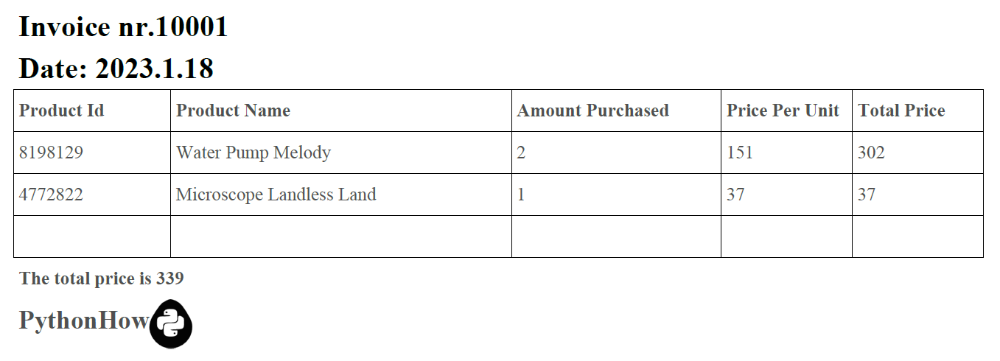

# PDF Invoice Generator from Excel with Python

## Project Description

**Overview :**  
The PDF Invoice Generator from Excel with Python is a versatile tool designed to automate the creation of professional-looking invoices from Excel data.

**Challenges :**  
Build PDF Invoice Generator that converts Excel-based invoice data into polished and standardized PDF invoices.

## Project Goal

The project aims to enhances efficiency, reduces manual errors, and ensures a consistent and professional presentation of financial documents.

## Tools & Library Used

 &nbsp;

## Project Result

[Click here to get full code](https://github.com/nickenshidqia/PDF_Invoice_Generator_Using_Python/blob/7c95831ee963feef4ce40405f1d6dddd3c50a3bc/main.py)  
[Click here to get PDF file](https://github.com/nickenshidqia/PDF_Invoice_Generator_Using_Python/tree/7c95831ee963feef4ce40405f1d6dddd3c50a3bc/PDF's)

### PDF Invoice Generator

